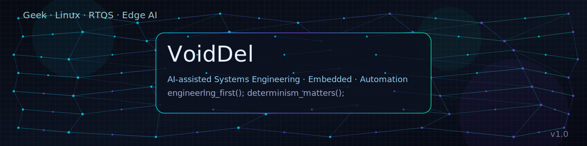

# 👋 Hi, I'm Feng

```text
AI-assisted Systems Engineer
```

I build **reliable, deterministic systems** for the real world.
AI is a tool — engineering is the foundation.

---

## 🧠 What I Do

* 🔧 **Embedded & Industrial Systems**
* 🤖 **AI-assisted Engineering**
* 🧪 **Test Infrastructure & HIL Systems**
* ⚙️ **Automation, Diagnostics, Long-running Systems**

I focus on systems that **run for years**, not demos that run once.

---

## 🛠️ Technical Stack

### 🧩 Embedded / Control

* STM32 · ESP32
* Bare-metal · RTOS
* CAN · CAN-FD · UDS · Modbus

### 🧪 Test & Automation

* HIL / EOL / Aging Test Systems
* LabVIEW · Python
* Industrial I/O · Relay Control · Power Measurement

### 🤖 AI (Applied, Not Hype)

* Edge AI
* Data-driven diagnostics
* AI-assisted testing & development workflows

### 🧱 Systems & Tools

* Python · Go
* Linux · Docker
* Git · CI-friendly tooling

---

## 🧭 Engineering Philosophy

```text
Engineering first.
Determinism matters.
AI assists, systems decide.
```

* Prefer **explicit control** over hidden magic
* Trust **specs, logs, and measurements**
* Build things that others can **maintain and extend**

---

## 📌 Featured Work (WIP)

> Selected projects around embedded systems, automation, and AI-assisted tooling.

* 🔹 CAN / UDS tooling
* 🔹 Test system frameworks
* 🔹 Automation utilities
* 🔹 AI-assisted diagnostics experiments

(More coming as projects mature.)

---

## 📍 Location

Hefei, China

---

## 🤝 Open to

* Technical collaboration
* System-level discussions
* Applied AI in industrial / embedded domains

---

> *“Build systems that behave, not systems that impress.”*

---
